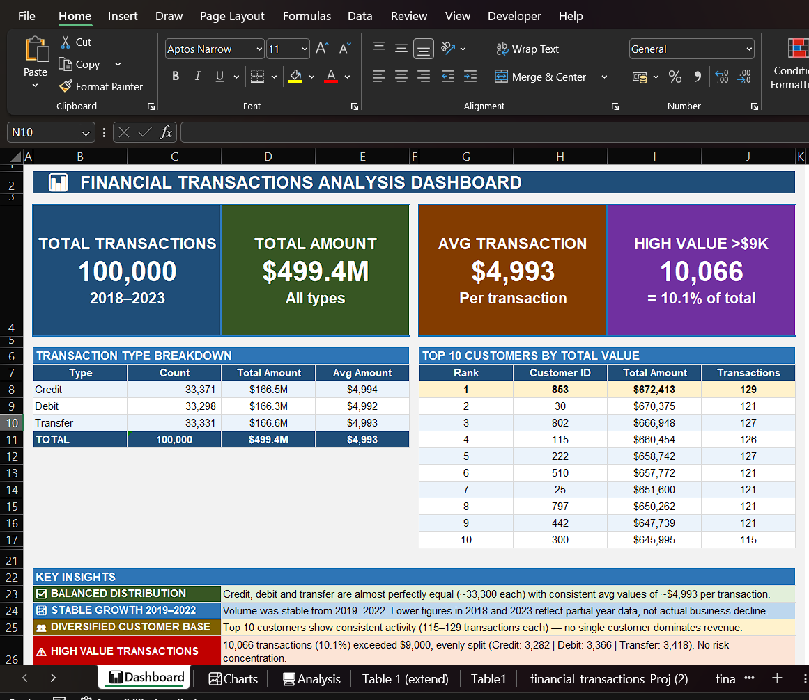

# Financial Transactions Analysis

## 📌 Overview
Analysed 100,000 financial transaction records spanning 6 years 
(2018–2023) to uncover trends, segment customers and detect 
high-value anomalies using Excel and Power Query.

---

## 🛠️ Tools Used
- Excel — PivotTables, PivotCharts, Dashboard, Conditional Formatting
- Power Query — Data cleaning, transformation, date formatting

---

## 📂 Dataset
- **Source:** financial_transactions_Project_1.csv
- **Size:** 100,000 rows
- **Columns:** Transaction ID, Date, Customer ID, Amount, Type, Description
- **Period:** 2018 – 2023

---

## 🔧 Data Cleaning
- Fixed date format using locale settings (DD/MM/YYYY)
- Verified zero duplicates across 100,000 transaction IDs
- Corrected column data types (date, number, text)
- Checked and resolved null/blank values

---

## 📊 Analysis & Findings

### 1. Transaction Type Breakdown
- Credit, debit and transfer are evenly distributed (~33,300 each)
- Average transaction value consistent at ~$4,993 across all types
- No single type dominates — balanced and healthy distribution

### 2. Yearly Trend
- Transaction volume stable from 2019–2022
- 2018 and 2023 show lower volume due to partial year data
- No real decline — data artifact, not business performance

### 3. Customer Segmentation
- Analysed 1,000+ unique customers
- Top customer (ID: 853) — $672,413 across 129 transactions
- Top 10 customers show consistent activity (115–129 transactions each)
- No single customer dominates revenue — diversified base

### 4. Anomaly Detection
- Flagged 10,066 transactions (10.1%) exceeding $9,000
- Evenly split: Credit 3,282 | Debit 3,366 | Transfer 3,418
- No concentration of high-value activity in any single type

---

## 📈 Dashboard
Built a professional Excel dashboard featuring:
- 4 KPI cards — total transactions, total amount, avg transaction, high value count
- Transaction type summary table
- Top 10 customer ranking table
- 3 charts — bar, line and pie
- Year slicer filtered to 2019–2022 (excluding partial years)
- Key insights section with 4 analytical conclusions

---

## 💡 Key Takeaways
- Balanced transaction distribution indicates stable business operations
- No anomalies by customer or transaction type — low concentration risk
- Partial year data (2018 & 2023) must be excluded for accurate trend analysis
- 10.1% high-value transaction rate warrants periodic monitoring

## 📸 Dashboard Preview

